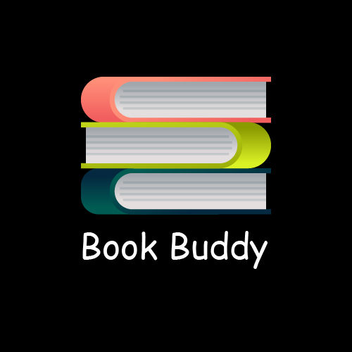
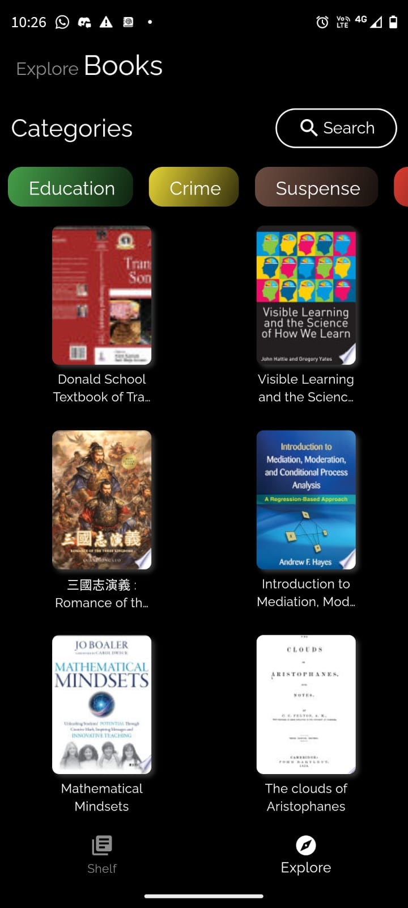
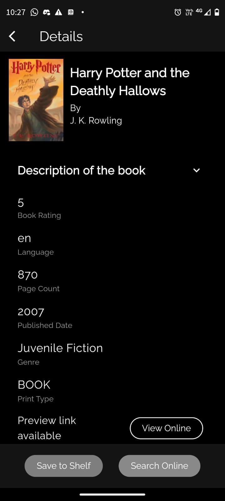
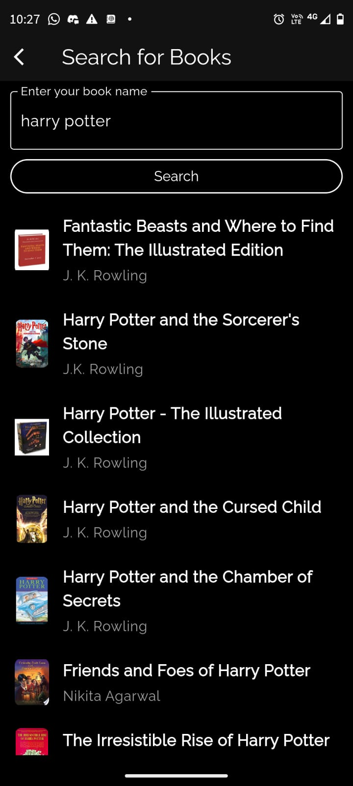
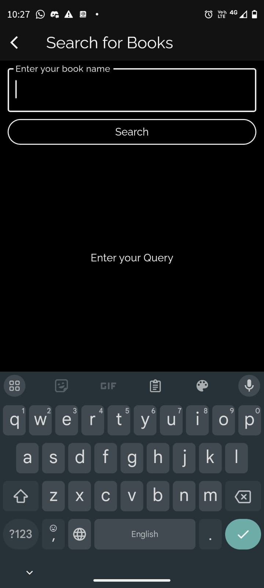
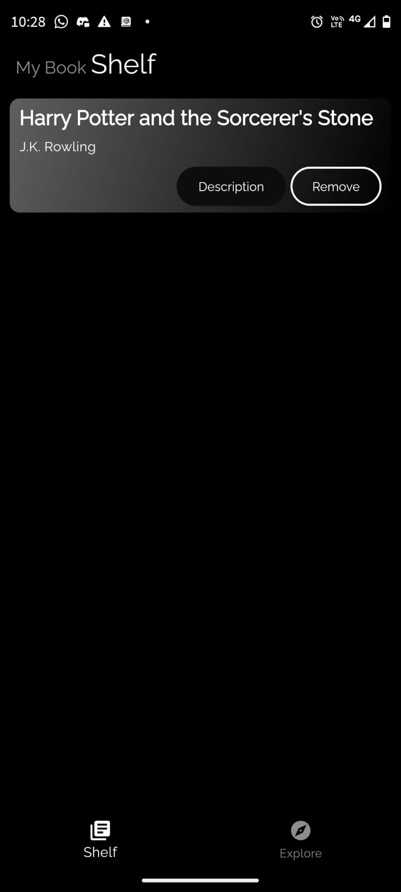
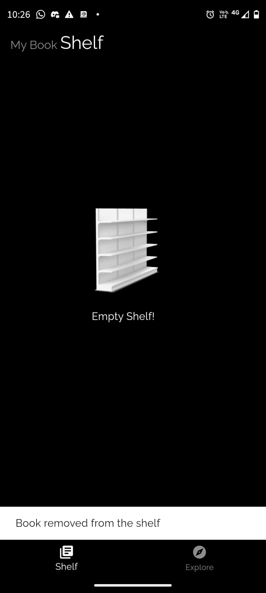

<!--
Hey, thanks for using the awesome-readme-template template.  
If you have any enhancements, then fork this project and create a pull request 
or just open an issue with the label "enhancement".

Don't forget to give this project a star for additional support ;)
Maybe you can mention me or this repo in the acknowledgements too
-->
<div align="center">

  
  <h1>Book Buddy</h1>
  
  <p>
    The amazing world of books at your fingertips!
  </p>
  
  
<!-- Badges -->
   
</div>

<br />

  

<!-- About the Project -->
## :star2: About the Project
Our Flutter mobile app offers a seamless and engaging experience for book lovers. With over 10 categories to explore, including Fiction, Sci-Fi, Education, and Thriller, you can effortlessly browse and discover a wide range of books tailored to your interests. Additionally, if you're looking to refresh the visual appeal of the app, you can easily switch to Light Mode, bringing a vibrant and new look to your browsing experience. Enjoy a personalized and dynamic interface that makes exploring and enjoying your favorite books a pleasure.

<!-- Screenshots -->
### :camera: Screenshots

<div align="center"> 
 <div>
   





 </div>
</div>


<!-- TechStack -->
### :space_invader: Tech Stack


  <ul>
    <li><a href="https://flutter.dev/">Flutter</a></li>
    <li><a href="https://pub.dev/packages/hive_flutter/">Hive</a></li>
    <li><a href="https://pub.dev/packages/flutter_bloc">BLoC</a></li>
  </ul>


<!-- Features -->
### :dart: Features

- <h4> Shelf Feature </h4>
Effortlessly manage your book collection with our app's Shelf feature. Store all your book details locally on your mobile and easily navigate through your curated list. With just a click, you can seamlessly remove any book from your collection. Enjoy a streamlined and user-friendly experience in managing your personal library.
- <h4>Category View</h4>
Want to explore books by category? Our app has you covered. Easily browse through more than 10 categories, including Fiction, Sci-Fi, Education, Thriller, and many more. Discover and enjoy a wide range of books tailored to your interests, all conveniently organized for effortless navigation.
- <h4>Light/Dark theme</h4>
Feeling bored with the existing theme of the app? Switch to Light Mode and visually refresh your app experience. Enjoy a new, vibrant look that brings a fresh perspective to your browsing.

<!-- Getting Started -->
## 	:toolbox: Getting Started

<!-- Prerequisites -->
### :bangbang: Prerequisites

- Project requires lastest flutter sdk installed.<br>
- A IDE such as VScode or Android Studio. <br>
- A emulator installed in the laptop, or the set up done in your phone. <br>
<br>
Run this command to get the report of the requirements and their availability.
<br>

```bash
  flutter doctor
```

<!-- Run Locally -->
### :running: Run Locally

- Clone the project

```bash
  git clone https://github.com/Chiru2004/BookBuddy_App.git
```

- Go to the project directory

```bash
  cd bookbuddyapp
```

- Install dependencies

```bash
  flutter pub get
```

- Start the emulator 

- Set up the API key in the .env file from <a href="https://developers.google.com/books">Google book API</a>.

- Run the project with command
```bash
  flutter run
```

<!-- Usage -->
## :eyes: Usage

With our app, you can preview book contents online before making a purchase. If you find a book you love, the app conveniently directs you to Google Books for easy purchasing. Discover ratings, descriptions, genres, and much more, all in one place, making your book browsing experience comprehensive and enjoyable!


<!-- Acknowledgments -->
## :gem: Acknowledgements

A big shout-out to these amazing resources and their creators!

 - [Flutterly](https://www.youtube.com/watch?v=w6XWjpBK4W8&list=PLptHs0ZDJKt_T-oNj_6Q98v-tBnVf-S_o)
 - [pub.dev](https://pub.dev/)
 - [Youtube](https://www.youtube.com/watch?v=FB9GpmL0Qe0&t=199s&pp=ygUlc3RvcmUgdG9kbyBsaXN0IHVzaW5nIGhpdmUgaW4gZmx1dHRlcg%3D%3D)
 - [Readme Template](https://github.com/Louis3797/awesome-readme-template/blob/main/README.md)
 - [Udemy](https://www.udemy.com/course/learn-flutter-dart-to-build-ios-android-apps/)
